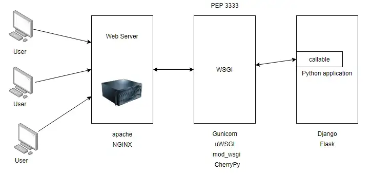

---

tags:
- python
- deploy
- server
- wsgi

---

## Introduction
Basic deploy schema:


## Sources:

[PEP 3333](https://peps.python.org/pep-3333/)
[All you need to know about WSGI video](https://www.youtube.com/watch?v=UklcIDgHtwQ)
[Servers which supports WSGI](https://wsgi.readthedocs.io/en/latest/servers.html)
[Process forking](https://en.wikipedia.org/wiki/Fork_(system_call))

## Basic description

### Web Server

Web server isn't necessary part, but it's strongly recomend to use it.
>[GUnicorn doc](https://docs.gunicorn.org/en/latest/deploy.html)
>We strongly recommend using Gunicorn behind a proxy server.
>...
>Although there are many HTTP proxies available, we strongly advise that you use [Nginx](https://nginx.org/). If you choose another proxy server you need to make sure that it buffers slow clients when you use default Gunicorn workers. Without this buffering Gunicorn will be easily susceptible to denial-of-service attacks. You can use [Hey](https://github.com/rakyll/hey) to check if your proxy is behaving properly.
>...

Apart from this, general purpose web server(or reverse proxy) will provide other functionality like:
- serve static content
- act as load balancer
- proxy cache
- More in this question: [Why put a reverse proxy in front of a WSGI server?](https://serverfault.com/questions/536144/why-put-a-reverse-proxy-in-front-of-a-wsgi-server)

### WSGI Server

##### *Before WSGI - CGI(Common gateway interface)*

[CGI Wiki](https://en.wikipedia.org/wiki/Common_Gateway_Interface)

Typical use-case flow
![[img/run_python_script_to_handle_http_req.png]]

1. Client send a form to a server within a http request with URL denoting a CGI script;
2. Web server create environment variables for parts of request(like headers, path, params etc, CGI standartized these env var names) and fork proccess;
3. Script executes in the forked process and return response to a web server;
4. Web server relays this response to the client.

##### *WSGI*

WSGI is a kind of extension to CGI for python, where standartized not just env var names, but the way how target function must be called

HW WSGI app

```python
def application(environ, start_response):
    start_response('200 OK', [('Content-Type', 'text/plain')])
    yield b'Hello, World!\n'
```

- name of function could be any
- environ - dict containing CGI env vars
- start_response - function that should be called before returning. Contains 2 arguments: status and list of headers
- return value could be string or generator

> In fact instead **application** function in example above, it can be any callable, so it means, it can be an object with implemented method __call__

So according to said above, WSGI standard could be implemented with simple script (wsgi.py for example) like this:
```python
from io import BytesIO

def call_application(app, environ):
    status = None
    headers = None
    body = BytesIO()
    
    def start_response(rstatus, rheaders):
        nonlocal status, headers
        status, headers = rstatus, rheaders
        
    app_iter = app(environ, start_response)
    try:
        for data in app_iter:
            assert status is not None and headers is not None, \
                "start_response() was not called"
            body.write(data)
    finally:
        if hasattr(app_iter, 'close'):
            app_iter.close()
    return status, headers, body.getvalue()

environ = {...}  # "environ" dict
status, headers, body = call_application(app, environ)
```

And handle request flow will looks like this:
![[run_python_wsgi.png]]

##### *Then why do we need separate piece of software called WSGI server?*

Performance!
![[python_raw_wsgi_for_performance.png]]
Forking process is a quite expensive operation to do it for every request and wsgi servers solves it by pre-forking proccess and utilise them to execute **callable**.
![[python_wsgi_prefork.png]]

### Callable
It can be any python script that doing something usefull for client who made request in other words it's business logic of our application. Many frameworks like Flask or Django can be used to simplify process of implementing this part, but all of them are out of scope of this note.